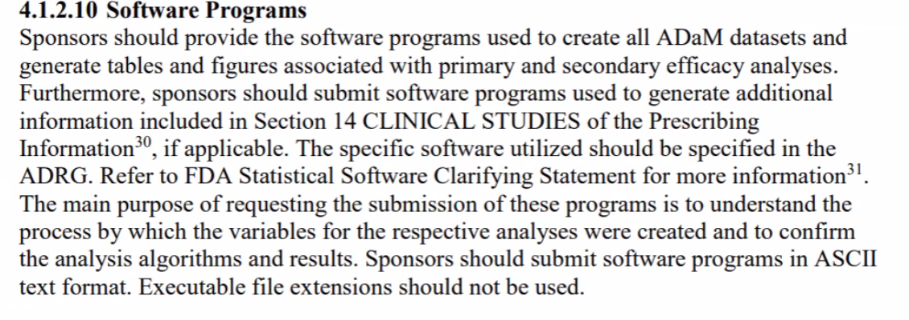

The meeting was held on zoom at 9AM Pacific Time on Friday, February 4th. The minutes taken by Joseph Rickert

### Attendees

Attendees included:

* Joseph Rickert - R Consortium
* Adrian Waddell - Roche
* Paul Schuette - FDA
* Bella Feng - 
* Yilong Zhang - Merck
* Eric Nantz - Lilly
* Doug Kelkhoff - Genentech
* Mike Stackhouse - Atorus Research
* Nan Xiao - Merck
* Ning Leng - Genentech
* Sascha Ahrweiler - Bayer
* Steven Hasendinckx J&J
* Phil Bowsher - RStudio
* Bob Engle - Biogen

### Minutes 

Joseph Rickert brought the meeting to order, reminded everyone of the [GitHub repo](https://github.com/RConsortium/submissions-wg) for the working group where minutes and other documents are kept, and summarized the goal articulated in the previous meeting to develop a pilot environment to study approaches for creating R submissions.

Mike Stackhouse noted that the group should focus on creating an environment that was "consumable" by the FDA. Paul Schuette agreed with this. He noted that the experiment he did with Eric Nantz two years ago (discussed in a previous meeting) was the closest he has come so far.

Next followed a discussion about the FDA computing environment, a discussion thread that developed over the course of the meeting. Some key points are:
* FDA reviewers and researchers work primarily on desktop machines that mostly run Windows 10.
* There are two classes of desktop computers 1) regulatory computers and 2) scientific computers.
* The scientific computers are not as rigorously controlled as the scientific computers.
* Paul has installed Ubuntu on a few of the scientific computers
* Desktop computers run SAS version 9.4, but the build may differ
* A perceived advantage of SAS is that it generally runs older software
* There is a pilot project going on at the FDA to run SAS on a server, which would ensure a common build. 
* When asked: If the FDA decided to move to Linux, how long would it take to convert all of the desktops from Windows to Linux, Paul speculated that it would take a minimum of two years. The implication is that Windows is not going away anytime soon.
* When asked about the installation of R packages, Paul indicated that installation was not a problem. 
* Obtaining R packages is more of an issue. In theory, the FDA could use MRAN or some other repository which enables downloading specific versions of packages.

The discussion turned to considering section 4.1.2.10 of the Study Data Technical Performance Guide:

Yilong Zhang stated that his company has focused on the sentence: "The Specific Software utilized should be specified in the ADRG." 
Mike Stackhouse explained that the PHUSE working group is is leading is also focused on interpreting this sentence.

Paul noted that companies are obligated to use the SAS export file format, but are not obligated to use SAS. Bella Feng noted that a recent FDA oncology pilot explicitly specifies SAS. 

Paul noted that many FDA analyses are hybrid using both SAS and R. The group acknowledge that all R submissions were the ultimate goal, we should be planning to work with mixed submissions for some time.

Mike Stackhouse stated that, although there are many corner cases, we should focus on building a reference platform along the lines of least resistance and go for what is easily achievable. The group generally agreed with this.

Towards the end of the meeting Paul mentioned that although the that section 4.1.2.10 specifies that programs should be submitted as text files, it does not mean that .txt extensions must be used. This surprised everyone. When asked if the FDA document could be revised to make this more clear, Paul stated that it was possible. He said that the document is generally revised once or twice a year, the most recent revision is dated Nov 20, 2020. 

** Action Item:** Paul stated that if the group wanted to suggest the wording to revise the document, he would submit it to the responsible FDA committee. He noted that to make the change it would need to be approved by the committee and go through the normal approval process.

Joseph Rickert asked the group to use the repo to submit their suggested changes to the wording about using text, and reminded everyone that the next meeting was set for Friday, March 5, 2021.

Joseph Rickert, Mike Stackhouse and Sascha Ahrweiler agreed to meet before the next Submissions group meeting to try and map out the various PHUSE, PSI and R Consortium working groups that are doing similar or complementary work.

The link to the video of the meeting is: 
https://zoom.us/rec/share/gFQancacysPFHm0Czrw3sAYOCrt35BgTbcodBdY2LGld4fkykDypkL99PX5o0i-c.JRCWwmZfO9Ui8G6f

Passcode: +GKR9&i6

