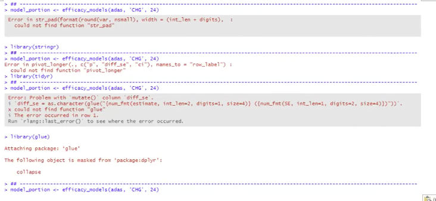
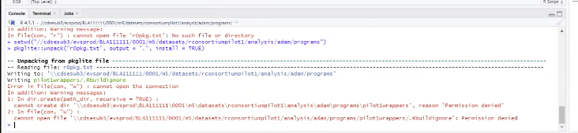

## Minutes from 2021-12-03 meeting of the Submissions Group
Compiled by Joseph Rickert

## Attendees:
* Phil Bowsher - RStudio
* Hye Soo Cho - FDA
* Heidi Curinckx - Johnson & Johnson
* Miriam Fossati - Merck
* Steven Hassendinckx
* Ellis Hughes
* Maria Matilde Kam - FDA
* Ning Leng - Genentech
* Emily Nguyen - FDA
* Joseph Rickert - R Consortium
* Paul Schuette - FDA
* Adrian Waddell - Roche
* Nan Xiao - Merck
* Jiang Xu - FDA
* Hong Yan - Regeneron
* Renping Zhang - FDA
* Yilong Zhang - Merck
* Jizu Zhi - FDA

## Minutes of 2021-12-03 Meeting prepared by Joseph Rickert

The meeting was recorded and the video is available [here](https://rstudio.zoom.us/rec/share/TPhUmx-9fsnaF8ZWkGqSXGgTqIZAuDy8Fvli182eRysycU5WPOse7kOzagdRU7Lh.acdswWFSSBr7m0K0) Passcode: 0tA$D+ev

**JR** Opened the meeting with the agenda to discuss the recent pilot submission through the FDA gateway and then discuss a request to have interested companies describe what they are currently doing with respect to FDA submissions in R.

**YZ** reported that the submission went through the gateway, thanked all who participated and was looking forward to receiving feedback from the FDA.

**JR** reported that there were still issues with employees from different companies using the RC portal. The current solution is to have people accessing the gateway on behalf of the RC use an R Consortium email address. **JR** wants to make sure that this is fine with the FDA.

At **6:37** into the video **PS** begins providing FDA feedback on the submission.

The initial findings were: 

* The submission was partially successful
* The were no problems with the .R extensions
* The FDA was unable to find the `Pilot1wrappers` package. However, the * * FDA analyst was able to generate tables
* The FDA thinks there may have been a switch in the high bit vs. bit settings and asked the WG to check this.
* The FDA analyst was able to retrieve the `pilot1wrappers` package from the Submission WG website, download the code and verify the results
* The FDA noted that including a dependency chart showing the 2nd and 3rd order dependencies would be very helpful.
If this were and actual submission, at least one IR request would have been generated.

On behalf of the WG, **JR** thanked the FDA team for making extra effort to retrieve the wrapper package and run the code.

In the subsequent discussion it was determined that the FDA analysts overlooked the instructions, buried in the ADRG, to unpack the `pilot1wrappers` from the file r0plg.txt. Once this was clarified **HC**, the FDA analyst, was able to execute the command and unpack the `pilot1wrappers` package. **HY** noted that in her experience, submissions with R code tend to be *ad hoc*, and that it is common to include a README file. The WG took note and agreed that it would be a good idea to include a `README` file that highlights the key steps, maybe by referring to the ADRG.

Next, followed a discussion about the requested dependency chart tree diagram. **PS** noted that the importance of dependencies depends on the setting. When running from a standard machine, FDA analysts are able to pull packages from the internet. However, when running from one of their scientific enclaves high performance computing environments they must port in the packages. To illustrate the problem with dependencies *HC* showed (See screen capture) the error messages generated by calling R packages previously installed on her machine, but which did not have the dependencies installed that are required to run the submission code. 

The problem seems to be that every file in the submission needs the library calls. This problem needs to be addressed.

**HC** also identified a problem of not having write permissions. See the following screen capture.

The temporary solution seems to be to copy the file into a temporary folder. This problem needs more thought.

It was agreed that the WG should produce a document about establishing the proper environment. **AW** suggests that there are two possible actions:
1. Copying to a local folder might clear up most of the problems
2. If not, the WG should look into environment reproducibility

**PS** noted that the FDA does not need to run on a central server. This implies that we can assume FDA analysts running on their local environments for the near future.

**PS** suggested having a pre-submission meeting explaining everything that is necessary to get everything installed and working. 

**AW** suggested that we set up the submission assuming that each file will be run from a fresh R session, and that perhaps we could run some tests to see if the environment is as is expected. 

**NL** asked about writing a blog post about the pilot submission. The WG agreed to write up the post and have **PS** and **HC** review.

**YL** asked about redoing the submission. **PS** said indicated that is common practice.

**NL** said that she and **HC** would like to schedule a separate meeting early next year to discuss where the various participating companies are in the process of making R submissions. Please let **NL** know if you are interested in participating. 

The next meeting is set for 9:00 AM Pacific Time on Friday, January 7, 2022.