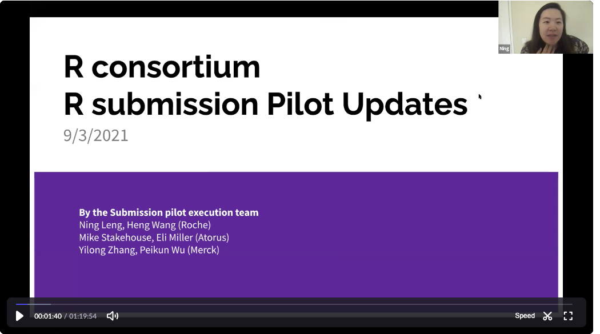

## Minutes of 2021-09-03 Meeting prepared by Joseph Rickert

  
View Attendee List

  
`r glue::glue_collapse(params$attendees, sep=" ")`

Joseph Rickert brought the meeting to order at 9:04 and began the video recording. He mentioned that Eli Miller reported although we do have credentials to use the FDA submissions gateway, these have timed out. Reactivating gateway access requires that I send an email to the FDA help desk. Eli recommends that I wait until we are nearly ready to submit before doing this.

Next, Ning Leng presented the recently up dated slides describing the R Submissions Pilot. Ning will upload this slides to the repo. 

The slides include the working time line for the series of pilot submissions:

* Pilot1: common analysis  (Q4 2021 - hopefully  Oct/early Nov)
* Pilot2: advanced analysis (Q2 2022)
* Pilot3: alternative formatting for package submission (TBD)

Timeline for near term work:
* 9/30/2021 complete the draft code and documents along with the internal review by the execution team
* 10/1 - 10/15 2021: review by the WG
* Late Oct: actual submission after adjudication 

The two major asks from the execution team:
1. WG members: provide feedback during the review in Oct
2. FDA: Identify potential reviewers

Next, there was a discussion about the content of the submission package and terminology. (9:48 in the video). This discussion also contains and explanation of the strategy for encoding the R package as a text file to get it through the gateway and how we will handle package dependencies.

In our documentation and communication we must be careful to distinguish between the Submission package for the pilot and the R Package containing R code that will be a part of the Submission package. Ning and the team will come up with names for both of these maybe: *Pilot1 Submission* for the Pilot1 Submission Package. The format for the Submission package will match the folder structure for the submission portal.

Joe then noted that we now have two R Consortium GitHub repositories associated with the working group.
1. https://github.com/RConsortium/submissions-wg is the primary repository for the working group. The Kanban board project on this repo is what we use to manage the submissions project.
2. The repo https://github.com/RConsortium/submissions-pilot1 is the code development repo for the Pilot1 submission.

Next, Adrian walked through the status of the tasks on the Kanban Board. (20:19 on the video).

Joe will write a blog post to describing what the submission team is doing with the intention of getting more pharma companies before the submission. Mike Stackhouse will help with getting it through the PHUSE marketing channels.

There was a discussion (43:30) about finding an FDA reviewer for the pilot. Paul Schuette took the action item to find someone who will probably be a statistician but not a formally designated FDA reviewer. It was suggested that the criteria for reviewing the pilot submission and the criteria for the success of the project be included in the cover letter.

Joe asked what would be required to communicate the success of the pilot. Paul stated that formal approval from the FDA would be required for a press release and that the project should be included as part of the FDA's Technology Modernization Action Plan (T-MAP) and the Data Modernization Action Plan (D-MAP). It would be best to investigate this after we have the proof of concept of the Pilot1. 

In response to the question if eventually we would want to have the pilot reviewed by a formal FDA reviewer, Paul noted that they have several R competent FDA reviewers especially among the new graduates. However, if a reviewer need help they would most likely reach out to the Paul's group.

When asked whether would expect reviewers to compare SAS and R results, Paul suggested that we should focus on a limited definition of validation for our first submission.

When asked whether we should have a future goal of having FDA reviewers to take the code in the submission package and and do further analyses, Paul stated that they can do that now. More interesting would be to have the submission package include a Shiny application for interactive data visualization.

At the top of the hour Joe asked whether anyone on the call was involved with preparing a presentation about the Submissions project for the upcoming R / Pharma conference. Paul responded that he may be. The FDA is still working out the details of a keynote talk in which Paul will participate. The group extended an offer to help provide material.

The group agreed to extend the meeting beyond the hour to review Ning's proposal for language to be added to section 4.1.2.10 of the Study Data Technical Performance Guide. (1:03 on video) Ning suggested adding:

> *Submission of programs with their native file extensions are acceptable, as long as binary file formats and pre-compilde code are not delivered.*

Paul stated that .bat files need to be excluded. This launched a discussion of how to generalize this. Paul suggested *executable* but Doug noted that .bat files are executable on Windows but not on other operating systems. Doug took the action to consider how to describe the issue in a more general fashion. Paul expressed the essential idea as "We can open it, we can look at it, but we don't want it to run."

In the final minutes, Adrian asked about not having to submit .txt files. Paul suggested that this would require changes within the Agency, and would probably require getting the suggested changes to 4.1.2.10 passed.

The next meeting is scheduled for Friday, October 1, 2020. At that meeting we will decide whether we need a special session to provide material for Paul's presentation.

The zoom [video recording](https://rstudio.zoom.us/rec/share/kBYMvXBfVsouRgM8By0kpPdQh5I8NRWqg68RRUe8rqVxCgsnHol3G6hOjFigqBtL.mp_rW8bsGP83qcEX) is available. Passcode: `#Sk!6tXL`
