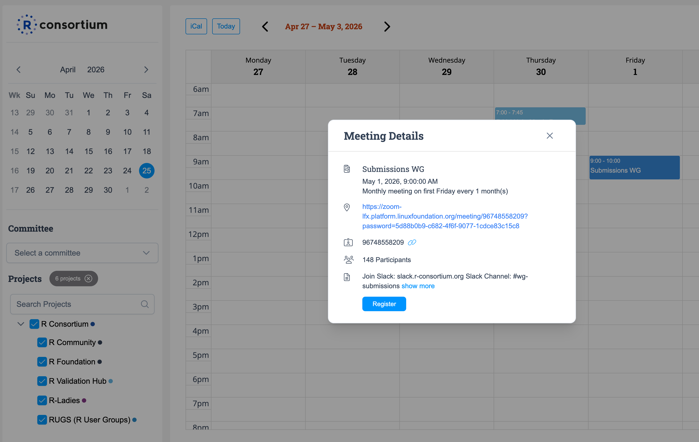

The Submissions Working Group welcomes everyone who is passionate about bringing innovation to the clinical submission process! Here are the ways to get involved:

## Slack

Join our Slack workspace to connect with the community and follow ongoing discussions in the `#wg-submissions` channel. There are two ways to join:

* Email `director[at]r-consortium.org` to request an invite.
* Ask any existing member to send you an invite directly.

Once you're in, you can find all discussions at [slack.r-consortium.org](https://slack.r-consortium.org).

## Meetings

**Working Group meetings** are held once a month, typically on the first Friday of each month.

**Pilot subgroup standups** are held more frequently. Currently, Pilot 6 and Pilot 7 each hold three standup meetings per month (weekly cadence, skipping one Friday per month).

All meetings are open to everyone. There are two ways to get on the calendar:

* Visit the [public calendar](https://zoom-lfx.platform.linuxfoundation.org/meetings/rcons?view=week) and add any meeting invite directly to your calendar. Click on a meeting to see its details and register.
* Ask R Consortium operations to add you to the distribution list — you will then receive calendar invites automatically. Send a note to `operations[at]r-consortium.org` to request this.

{fig-alt="Screenshot of the R Consortium public calendar showing the Submissions WG monthly meeting details popup with a Register button."}

## Mailing List

* Review and subscribe to the mailing list at [lists.r-consortium.org/g/Rconsortium-wg-submissions](https://lists.r-consortium.org/g/Rconsortium-wg-submissions).